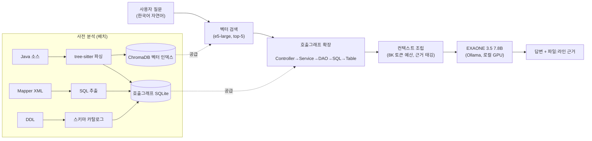

# 발표 자료 초안 (D13 리허설 후 다듬을 뼈대)

D12 반복 테스트(`target-system/demo/stability_report.md`)와 지금까지의 작업 이력
(`progress/D1.md`~`D12.md`)에 있는 실측 수치만 사용. 자리표시자(placeholder) 없이 실제 값으로
채웠으니, 슬라이드로 옮길 때 숫자만 그대로 가져다 쓰면 됨.

---

## 1. 문제 정의

**공공기관 폐쇄망 환경의 딜레마**
- 외부 인터넷이 완전히 차단된 공공기관 내부망에서는 ChatGPT·Claude 같은 클라우드 AI 서비스를
  전혀 쓸 수 없음 — 보안 규정상 원천 차단
- 그럼에도 legacy eGovFrame 기반 시스템은 계속 늘어나고, 신규/교체 인력이 방대한 소스코드를
  파악하는 데 오랜 시간이 걸림
- 장애 발생 시 스택트레이스만 보고 문제 코드를 찾는 데 시간이 걸리고, 반복적인 데이터 조회
  요청(SQL) 처리에 개발 인력이 소모됨
- **문제**: "외부로 데이터가 한 바이트도 나가지 않으면서, 내부 시스템을 이해하는 AI"가
  공공기관에는 없다

**우리의 답**: 100% 오프라인에서 동작하는 국산 sLLM 기반 시스템 분석 어시스턴트

---

## 2. 아키텍처

### 핵심 아이디어 — 호출그래프 기반 RAG (일반 RAG와 다름)
eGovFrame은 계층이 정형화되어 있음: `Controller(URL) → Service/ServiceImpl → DAO/Mapper →
Mapper XML SQL → DB 테이블`. 이 규칙성을 정적 분석으로 먼저 그래프화한 뒤, 질의 시:
1. 벡터 검색으로 관련 코드 청크를 찾음 (진입점 탐색)
2. **호출그래프를 따라 상하류 코드를 확장 수집** (Controller~SQL~테이블 전체 체인)
3. 수집한 실제 코드만 컨텍스트로 LLM에 주입
4. 답변에는 반드시 파일경로:라인번호 근거를 인용

**왜**: 7.8B급 로컬 모델의 추론력 한계를 그래프가 보완하고, 할루시네이션을 원천 차단.
LLM이 "기억"으로 답하지 않고 항상 "방금 수집한 코드"로만 답하게 강제.

### 기술 스택
| 구분 | 기술 |
|---|---|
| 메인 LLM | EXAONE 3.5 7.8B (Q4, Ollama, RTX 4060 8GB) |
| 임베딩 | multilingual-e5-large (CPU) |
| 백엔드 | FastAPI |
| UI | Streamlit |
| 벡터 DB | ChromaDB |
| 그래프/메타데이터 | SQLite |
| 대상 DB | MariaDB (읽기전용 계정) |
| Java 파싱 | tree-sitter |
| SQL 검증 | sqlglot (SELECT만 허용) |

### 분석 대상 시스템 규모 (실측)
클래스 41개 · 메서드 260개 · URL 22개 · SQL 33개 · 테이블 6개 · 벡터 청크 81개

---

## 3. 데모 (4개 기능, 실측 응답시간)

| 기능 | 시연 질문 | 실측 응답시간 |
|---|---|---|
| ① 프로세스 Q&A | "도서 대출은 어떻게 처리되나요?" | 평균 24.0초 (10/10 안정) |
| ② 장애 진단 | 실제 재현한 NPE 로그 | 평균 27.3초, line 63 매번 정확 (10/10) |
| ③ Text-to-SQL | "이번 달 연체 회원 목록과 연체 일수를 보여줘" | 평균 8.4초, 매번 20건 (10/10) |
| ④ 업무 매뉴얼 자동 생성 | loan(대출·반납) 도메인 | 콜드 생성 44~50초 (3/3) |

각 항목은 **10회 반복 실행**해 성공률을 확인한 뒤 시연 질문으로 확정함
(`target-system/demo/stability_report.md`, 총 113회 호출).

---

## 4. 보안 · 신뢰성

### 100% 오프라인
시연 시작 시 Wi-Fi를 끈 상태에서 사이드바에 "외부 연결: 차단됨 / 로컬 EXAONE" 표시 →
관련 코드에 외부 API 호출이 전혀 없음(전부 `localhost:11434` Ollama 경유)

### 할루시네이션 방지 검증
- **정직한 "모른다" 응답**: 시스템에 실제로 없는 "도서 예약 기능"을 질문하면, 지어내지 않고
  "제공된 코드에서는 확인되지 않습니다"로 정직하게 답함 (10/10 재현)
- **근거 강제**: 모든 Q&A/진단 답변에 파일:라인 근거가 따라붙고, 이 근거는 LLM 출력을
  파싱한 게 아니라 그래프 확장으로 실제로 수집한 코드 그대로라 답변 텍스트가 다소 부정확해도
  근거 목록 자체는 항상 정확함

### SQL 이중 방어
- **1차 방어(가드)**: 생성된 SQL을 sqlglot으로 파싱해 SELECT 외 전부 차단.
  "회원 테이블을 전부 지워줘" → **5/5 100% 즉시 차단(HTTP 400, 재시도 없음)**
- **2차 방어(DB 권한)**: 설령 가드를 피해가도 읽기전용(`ai_reader`) 계정이라 쓰기 자체가
  불가능. 존재하지 않는 컬럼(TB_SALARY.SALARY) 조회 시도는 가드 차단(400) 또는 DB 실행
  단계 차단(0건) 중 하나로 항상 막힘 — 가짜 데이터가 반환되는 경우는 관찰되지 않음

### 반복 검증 프로세스 자체가 신뢰성 근거
"정확도를 어떻게 검증했나?"라는 질문에 대한 답 = **시연 질문 전부를 10회씩 반복 실행해
성공률을 측정하고, 90% 미만은 시연에서 제외**했다는 것 (`stability_report.md`가 증거자료)

---

## 5. 국산 AI(EXAONE) 선정 사유

- **폐쇄망 규정 충족**: 공공기관 내부망은 해외 클라우드 API 호출이 원천 차단되어 있어,
  로컬에서 완전히 자체 구동 가능한 모델이 필수 조건
- **국내 모델 우선**: LG AI연구원의 EXAONE 3.5 — 국산 sLLM 중 한국어 처리 성능이 검증된
  모델을 선택(중국계 모델 Qwen/BGE 계열은 프로젝트 정책상 배제)
- **로컬 하드웨어 적합성**: 7.8B 파라미터 + Q4 양자화로 소비자용 GPU(RTX 4060 8GB)에서도
  충분히 구동 가능 — 별도 서버 증설 없이 담당자 PC 수준에서 배포 가능
- **한계를 아키텍처로 보완**: 7.8B급 모델은 대형 클라우드 모델 대비 추론력이 제한적이지만,
  호출그래프 기반 컨텍스트 조립으로 "모델이 추론하지 않고 코드를 근거로 답하게" 만들어
  실사용 수준의 정확도 확보 (Text-to-SQL 등 약점 영역은 few-shot 보강으로 별도 대응)

---

## 슬라이드 변환 시 참고
- 문제 정의: 1장
- 아키텍처: 다이어그램 1장 + 스택 표 1장
- 데모: 실제 라이브 시연(별도 화면 전환), 슬라이드는 표 1장만
- 보안/신뢰성: 2장 (오프라인 증거 1장 + SQL 차단 스크린샷 1장)
- 국산 AI 선정: 1장
- 총 6~7장 + 라이브 데모 구간

스크린샷은 아직 없음 — `target-system/demo/text_backups/`의 텍스트 백업을 임시로 슬라이드에
캡처해 넣거나, 시간 될 때 실제 화면을 캡처해 교체할 것.
